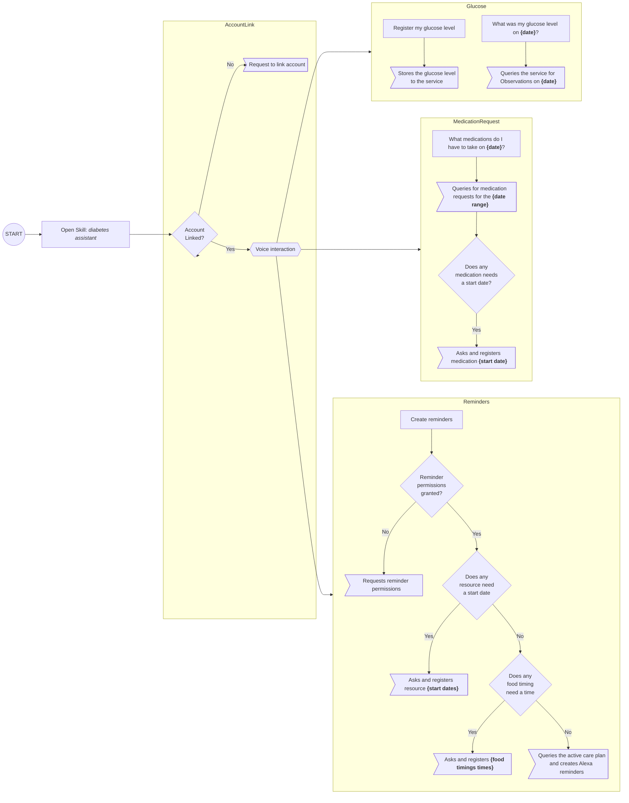

# Alexa voice interaction model

## User actions

### What medications do I have to take on {date}?

### Remind me to take my medications

### Create reminders (?)

### What was my blood glucose level on {date}?

### Register my blood glucose level

#### Set up: food timing time

#### Set up: resource (medication/service request) start date
