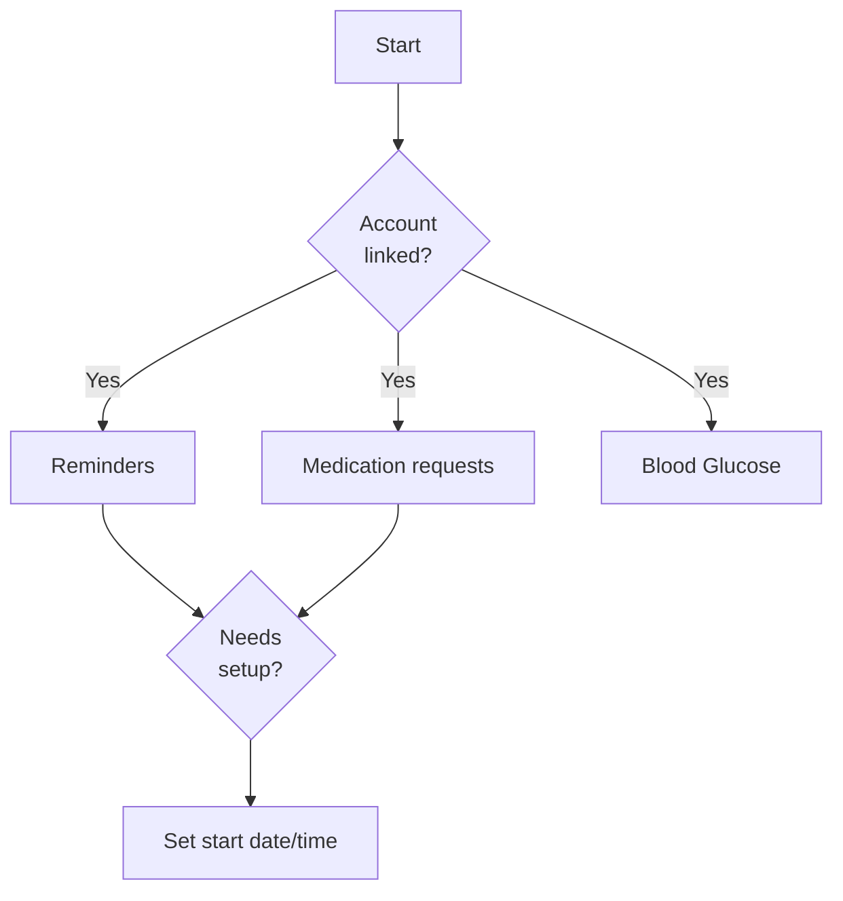
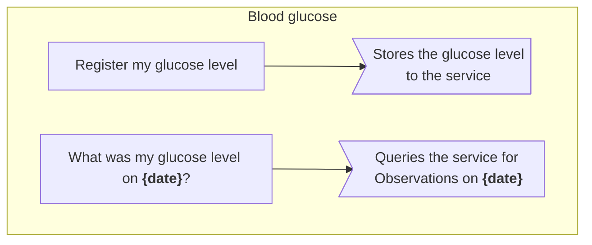
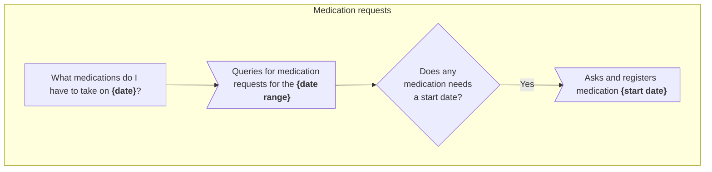
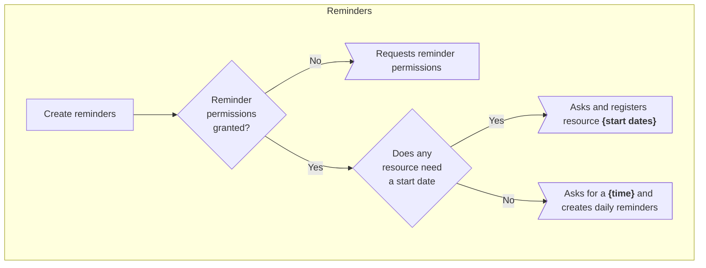
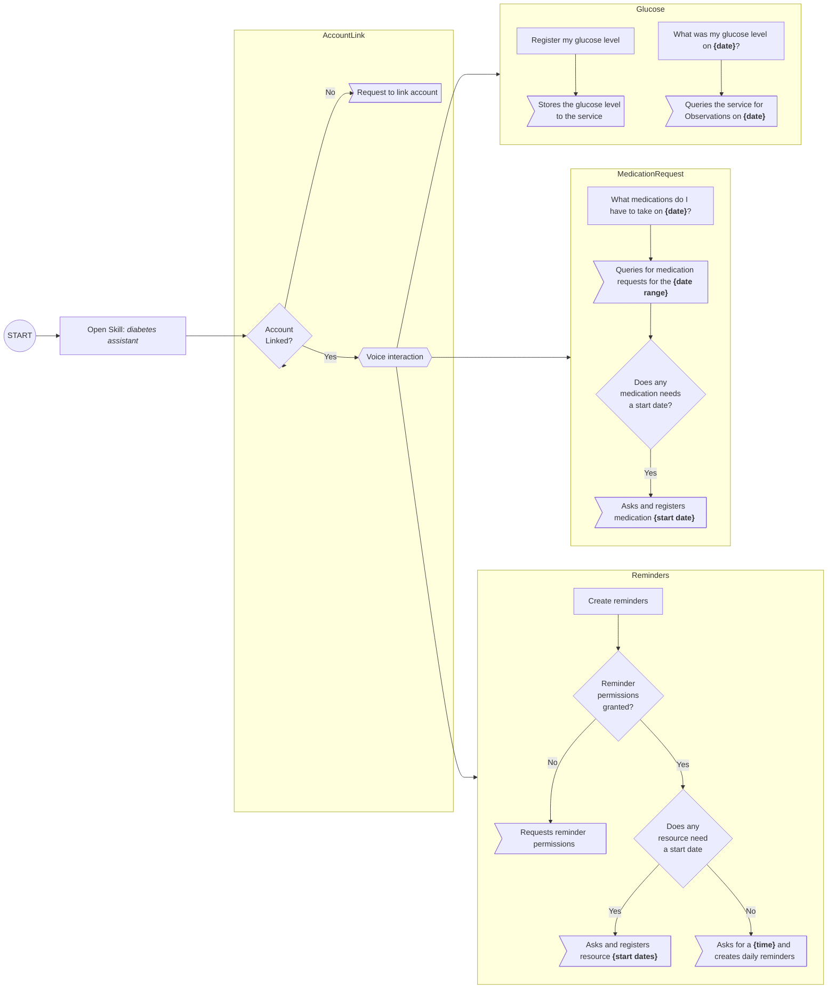

# Alexa voice interaction model

_The patient needs to link their account before performing any action._

Entire model

## User actions

### What medications do I have to take on {date}? (1)

Queries active `medication requests` on a given date

### Create reminders at {time} (1)

Creates daily reminders at the provided time. Reminders will honor the requests' day of week (e.g. will not create a reminder in a day when the patient does not have a scheduled medication).

Queries active `care plans` and creates reminders for `medication requests` and `service requests`.

### What was my blood glucose level on {date}?

Queries `observations` on a given date

### Register my blood glucose {level} at {timing}

Saves a blood glucose level reading taken at some timing 

---

The following are prompted when some set up is needed

#### [1] Set up: resource (medication/service request) start date/time

The medication or service request doesn't have a specific start date/time (e.g., take pills twice a day for two weeks, it doesn't say when to start). Prompts the patient to set up a start date and start time if needed.
